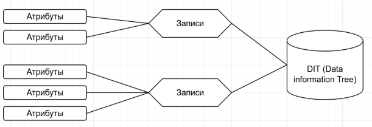
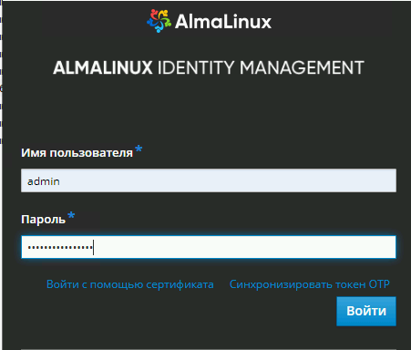
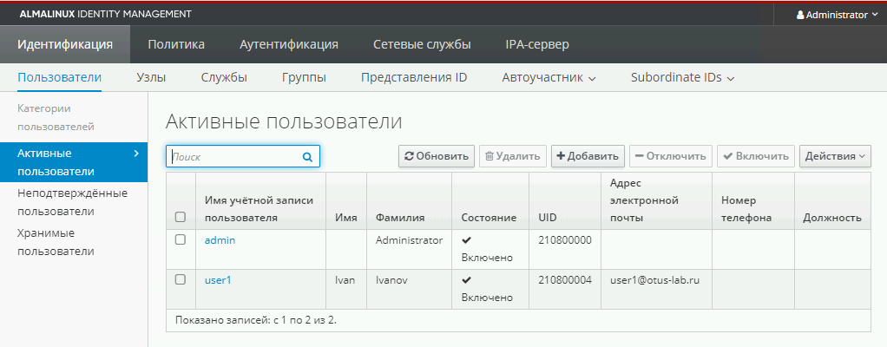

# 38. LDAP. Централизованная авторизация и аутентификация

## Задание

+ Цель домашнего задания:  
Научиться настраивать LDAP-сервер и подключать к нему LDAP-клиентов

+ Описание домашнего задания:  
1) Установить FreeIPA
2) Написать Ansible-playbook для конфигурации клиента


Дополнительное задание  
3)* Настроить аутентификацию по SSH-ключам  
4)** Firewall должен быть включен на сервере и на клиенте

#### Теоретическая часть   
LDAP (Lightweight Directory Access Protocol — легковесный протокол доступа к каталогам) —  это протокол для хранения и получения данных из каталога с иерархической структурой.  
LDAP не является протоколом аутентификации или авторизации 

С увеличением числа серверов затрудняется управление пользователями на этих сервере. LDAP решает задачу централизованного управления доступом. 
С помощью LDAP можно синхронизировать:
UID пользователей
Группы (GID)
Домашние каталоги
Общие настройки для хостов 
И т. д. 

LDAP работает на следующих портах: 
389/TCP — без TLS/SSL
636/TCP — с TLS/SSL

Основные компоненты LDAP



Атрибуты — пара «ключ-значение». Пример атрибута: mail: admin@example.com
Записи (entry) — набор атрибутов под именем, используемый для описания чего-либо

Пример записи:
dn: sn=Ivanov, ou=users, dc=otus-lab,dc=ru
objectclass: person
sn: Ivanov
cn: Ivan Ivanov

Data Information Tree (DIT) — организационная структура, где каждая запись имеет ровно одну родительскую запись и под ней может находиться любое количество дочерних записей. Запись верхнего уровня — исключение
На основе LDAP построено много решений, например: Microsoft Active Directory, OpenLDAP, FreeIPA и т. д.

В данной лабораторной работе будет рассмотрена установка и настройка FreeIPA. 
FreeIPA — это готовое решение, включающее в себе:  
Сервер LDAP на базе Novell 389 DS c предустановленными схемами  
Сервер Kerberos  
Предустановленный BIND с хранилищем зон в LDAP  
Web-консоль управления  

### Практическая часть  

+ Виртуальные машины разворачиваются на Proxmox VE 8.4  

Сервер - Alma Linux 9.6
Клиенты - Ubuntu 22.04
[Ссылка на документацию](https://galaxy.ansible.com/ui/repo/published/freeipa/ansible_freeipa/docs/)
```txt
Supported Distributions
RHEL/CentOS 7.4+
Fedora 40+
Ubuntu
Debian 10+ (ipaclient only, no server or replica!)
```

<details>

<summary>
ipa-srv.otus-lab.ru ansible_host=192.168.50.100
ipa-cln1.otus-lab.ru ansible_host=192.168.50.101
ipa-cln2.otus-lab.ru ansible_host=192.168.50.102

</summary>

```
[ipaserver]
ipa-srv.otus-lab.ru ansible_host=192.168.50.100

[ipaserver:vars]
ipaserver_domain=otus-lab.ru
ipaserver_realm=OTUS-LAB.RU
# Пароли администратора и менеджера каталогов
ipaadmin_password=OtusPassword123!
ipadm_password=OtusPassword123!
# Настройка DNS 
ipaserver_setup_dns=yes
ipaserver_no_host_dns=yes


[ipaclients]
ipa-cln1.otus-lab.ru ansible_host=192.168.50.101
ipa-cln2.otus-lab.ru ansible_host=192.168.50.102

```

</details>

#### 1. Настройка Free IPA сервера  

1.1 Настройка ansible-host

Устанавливаем коллекцию ansible-freeipa  

```bash
ansible-galaxy collection install freeipa.ansible_freeipa
```

1.2 Настраиваем inventory-файл 

1.3 Настраиваем ansible-playbook  

Включаем роль ipaserver из установленной коллекции: 

```yaml  
---
- name: Установка FreeIPA Server на Alma Linux 9.6
  hosts: ipaserver
  become: true

  vars:
    ipa_fqdn: "ipa-srv.otus-lab.ru"
    ipaadmin_password: "OtusPassword123!"
    ipadm_password: "OtusPassword123!"
    ipaserver_domain: "otus-lab.ru"
    ipaserver_realm: "OTUS-LAB.RU"
    ipaserver_setup_dns: yes
    ipaserver_forwarders: ["8.8.8.8"]
    # Автоматически открыть порты в firewalld
    ipaserver_setup_firewalld: yes
    # Игнорировать наличие внешнего DNS и перезаписать зону
    # Для лабораторной работы приемлемо, на практике надо создавать поддомен следующего уровня
    ipaserver_allow_zone_overlap: yes

  pre_tasks:
    - name: Установка корректного Hostname
      hostname:
        name: "{{ ipa_fqdn }}"

    - name: Обновление кэша DNF и установка базовых зависимостей
      dnf:
        name:
          - python3-dnf
          - python3-netaddr  # Часто нужен для роли freeipa
        state: present
        update_cache: yes


#    - name: Включение модуля IDM # Для Alma Linux 9 не требуется
#      dnf:
#        name: "@idm:DL1"
#        state: present

  roles:
    - role: freeipa.ansible_freeipa.ipaserver
      state: present
...
```

1.4 Запускаем плэйбук  

```bash
ansible-playbook -i your_inventory_file deploy_lab_ipa.yml
```

Примечания:
+ на целевом сервере настроено корректное полное доменное имя (FQDN), которое резолвится в его IP-адрес  
+ в hosts-файле ip-адрес машины должен быть сопопставлен сначала с полным FQDN-именем и только затем с кратким. FreeIPA требует, чтобы hostname возвращал именно FQDN 
+ Для стабильной работы FreeIPA требуется минимум 4 ГБ RAM и 2 CPU, и даже с двумя CPU вывод top показывает top average 3,5 - 4,1
+ Плейбук настроит сервисы, но нужно проверять, что в системе или внешнем фаерволе открыты порты: 53, 80, 443 (TCP) и 88, 464, 389, 636 (TCP/UDP) - в этой лабораторной они привязались к ipv6 адресам (на современных ОС ipv4 - надстройка над ipv6)
+ после неудачных запусков требуется очистка конфигурационных файлов:

```bash
sudo ipa-server-install --uninstall --unattended
```

1.5 Проверка запуска ipa-сервера  

```bash
[root@ipa-srv ~]# ipactl status
Directory Service: RUNNING
krb5kdc Service: RUNNING
kadmin Service: RUNNING
named Service: RUNNING
httpd Service: RUNNING
ipa-custodia Service: RUNNING
pki-tomcatd Service: RUNNING
ipa-otpd Service: RUNNING
ipa-dnskeysyncd Service: RUNNING
ipa: INFO: The ipactl command was successful
[root@ipa-srv ~]#

```

#### Настройка клиентов  

1.1 Доработка плэйбука deploy-ipa-srv.yml 

+ Добавляем настройку пользователей клиентов   

```yaml
  tasks:
    - name: Create test group "devs"
      freeipa.ansible_freeipa.ipagroup:
        ipaadmin_password: "{{ ipaadmin_password }}"
        name: devs
        description: "developers"

    - name: Create test user "user1"
      freeipa.ansible_freeipa.ipauser:
        ipaadmin_password: "{{ ipaadmin_password }}"
        name: user1
        first: Ivan
        last: Ivanov
        password: "UserPassword123!"
        state: present

    - name: Ensure user1 is in group "devs"
      freeipa.ansible_freeipa.ipagroup:
        ipaadmin_password: "{{ ipaadmin_password }}"
        name: devs
        user:
          - user1
        state: present
```

1.2 Прописываем ssh-ключи на клиентских машинах  

```bash
ssh-copy-id nn@192.168.50.101
ssh-copy-id nn@192.168.50.102
```

+ Проверяем связность

```yaml
ansible ipaclients -i inventory -m  ping
ipa-cln2.otus-lab.ru | SUCCESS => {
    "ansible_facts": {
        "discovered_interpreter_python": "/usr/bin/python3"
    },
    "changed": false,
    "ping": "pong"
}
ipa-cln1.otus-lab.ru | SUCCESS => {
    "ansible_facts": {
        "discovered_interpreter_python": "/usr/bin/python3"
    },
    "changed": false,
    "ping": "pong"
}
```
1.3 Запускаем плэйбук  
<details>

```bash
nn@u22-ansible:~/ansible/38-ldap$ ansible-playbook -i inventory deploy_ipa_clients.yml -K
BECOME password:
[WARNING]: Collection freeipa.ansible_freeipa does not support Ansible version 2.10.8

PLAY [Настройка клиентов FreeIPA на Ubuntu 22.04] ***************************************************************

TASK [Gathering Facts] ******************************************************************************************
ok: [ipa-cln1.otus-lab.ru]
ok: [ipa-cln2.otus-lab.ru]

TASK [Update apt cache to prevent 404 errors] *******************************************************************
changed: [ipa-cln1.otus-lab.ru]
changed: [ipa-cln2.otus-lab.ru]

TASK [Install necessary packages for role] **********************************************************************
ok: [ipa-cln2.otus-lab.ru]
ok: [ipa-cln1.otus-lab.ru]

TASK [Enable automatic home directory creation on Ubuntu] *******************************************************
changed: [ipa-cln2.otus-lab.ru]
changed: [ipa-cln1.otus-lab.ru]

TASK [Принудительно устанавливаем DNS сервера IPA] **************************************************************
changed: [ipa-cln2.otus-lab.ru]
ok: [ipa-cln1.otus-lab.ru]

TASK [Проверка резолва SRV записей (диагностика)] ***************************************************************
changed: [ipa-cln1.otus-lab.ru]
changed: [ipa-cln2.otus-lab.ru]

TASK [freeipa.ansible_freeipa.ipaclient : Import variables specific to distribution] ****************************
ok: [ipa-cln2.otus-lab.ru] => (item=/home/nn/.ansible/collections/ansible_collections/freeipa/ansible_freeipa/rol
ok: [ipa-cln1.otus-lab.ru] => (item=/home/nn/.ansible/collections/ansible_collections/freeipa/ansible_freeipa/rol

TASK [freeipa.ansible_freeipa.ipaclient : Install IPA client] ***************************************************
included: /home/nn/.ansible/collections/ansible_collections/freeipa/ansible_freeipa/roles/ipaclient/tasks/installn2.otus-lab.ru

TASK [freeipa.ansible_freeipa.ipaclient : Install - Set packages for installation] ******************************
ok: [ipa-cln1.otus-lab.ru]
ok: [ipa-cln2.otus-lab.ru]

TASK [freeipa.ansible_freeipa.ipaclient : Install - Set packages for installlation, add DOT] ********************
skipping: [ipa-cln1.otus-lab.ru]
skipping: [ipa-cln2.otus-lab.ru]

TASK [freeipa.ansible_freeipa.ipaclient : Install - Ensure that packages are installed] *************************
ok: [ipa-cln2.otus-lab.ru]
ok: [ipa-cln1.otus-lab.ru]

TASK [freeipa.ansible_freeipa.ipaclient : Install - Set ipaclient_servers] **************************************
skipping: [ipa-cln1.otus-lab.ru]
skipping: [ipa-cln2.otus-lab.ru]

TASK [freeipa.ansible_freeipa.ipaclient : Install - Set ipaclient_servers from cluster inventory] ***************
skipping: [ipa-cln1.otus-lab.ru]
skipping: [ipa-cln2.otus-lab.ru]

TASK [freeipa.ansible_freeipa.ipaclient : Install - Check that either password or keytab is set] ****************
skipping: [ipa-cln1.otus-lab.ru]
skipping: [ipa-cln2.otus-lab.ru]

TASK [freeipa.ansible_freeipa.ipaclient : Install - Set default principal if no keytab is given] ****************
ok: [ipa-cln1.otus-lab.ru]
ok: [ipa-cln2.otus-lab.ru]

TASK [freeipa.ansible_freeipa.ipaclient : Install - Fail on missing ipaclient_domain and ipaserver_domain] ******
skipping: [ipa-cln1.otus-lab.ru]
skipping: [ipa-cln2.otus-lab.ru]

TASK [freeipa.ansible_freeipa.ipaclient : Install - Fail on missing ipaclient_dns_servers] **********************
skipping: [ipa-cln1.otus-lab.ru]
skipping: [ipa-cln2.otus-lab.ru]

TASK [freeipa.ansible_freeipa.ipaclient : Install - Configure DNS resolver] *************************************
skipping: [ipa-cln1.otus-lab.ru]
skipping: [ipa-cln2.otus-lab.ru]

TASK [freeipa.ansible_freeipa.ipaclient : Install - IPA client test] ********************************************
ok: [ipa-cln2.otus-lab.ru]
ok: [ipa-cln1.otus-lab.ru]

TASK [freeipa.ansible_freeipa.ipaclient : Install - Cleanup leftover ccache] ************************************
ok: [ipa-cln2.otus-lab.ru]
ok: [ipa-cln1.otus-lab.ru]

TASK [freeipa.ansible_freeipa.ipaclient : Install - Configure NTP] **********************************************
ok: [ipa-cln2.otus-lab.ru]
ok: [ipa-cln1.otus-lab.ru]

TASK [freeipa.ansible_freeipa.ipaclient : Install - Make sure One-Time Password is enabled if it's already define
skipping: [ipa-cln1.otus-lab.ru]
skipping: [ipa-cln2.otus-lab.ru]

TASK [freeipa.ansible_freeipa.ipaclient : Install - Disable One-Time Password for on_master] ********************
skipping: [ipa-cln1.otus-lab.ru]
skipping: [ipa-cln2.otus-lab.ru]

TASK [freeipa.ansible_freeipa.ipaclient : Install - Test if IPA client has working krb5.keytab] *****************
ok: [ipa-cln1.otus-lab.ru]
ok: [ipa-cln2.otus-lab.ru]

TASK [freeipa.ansible_freeipa.ipaclient : Install - Disable One-Time Password for client with working krb5.keytab
skipping: [ipa-cln1.otus-lab.ru]
skipping: [ipa-cln2.otus-lab.ru]

TASK [freeipa.ansible_freeipa.ipaclient : Install - Keytab or password is required for getting otp] *************
skipping: [ipa-cln1.otus-lab.ru]
skipping: [ipa-cln2.otus-lab.ru]

TASK [freeipa.ansible_freeipa.ipaclient : Install - Create temporary file for keytab] ***************************
skipping: [ipa-cln1.otus-lab.ru]
skipping: [ipa-cln2.otus-lab.ru]

TASK [freeipa.ansible_freeipa.ipaclient : Install - Copy keytab to server temporary file] ***********************
skipping: [ipa-cln1.otus-lab.ru]
skipping: [ipa-cln2.otus-lab.ru]

TASK [freeipa.ansible_freeipa.ipaclient : Install - Get One-Time Password for client enrollment] ****************
skipping: [ipa-cln1.otus-lab.ru]
skipping: [ipa-cln2.otus-lab.ru]

TASK [freeipa.ansible_freeipa.ipaclient : Install - Store the previously obtained OTP] **************************
skipping: [ipa-cln1.otus-lab.ru]
skipping: [ipa-cln2.otus-lab.ru]

TASK [freeipa.ansible_freeipa.ipaclient : Install - Remove keytab temporary file] *******************************
skipping: [ipa-cln1.otus-lab.ru]
skipping: [ipa-cln2.otus-lab.ru]

TASK [freeipa.ansible_freeipa.ipaclient : Store predefined OTP in admin_password] *******************************
skipping: [ipa-cln1.otus-lab.ru]
skipping: [ipa-cln2.otus-lab.ru]

TASK [freeipa.ansible_freeipa.ipaclient : Install - Check if principal and keytab are set] **********************
skipping: [ipa-cln1.otus-lab.ru]
skipping: [ipa-cln2.otus-lab.ru]

TASK [freeipa.ansible_freeipa.ipaclient : Install - Check if one of password or keytabs are set] ****************
skipping: [ipa-cln1.otus-lab.ru]
skipping: [ipa-cln2.otus-lab.ru]

TASK [freeipa.ansible_freeipa.ipaclient : Install - From host keytab, purge OTUS-LAB.RU] ************************
changed: [ipa-cln2.otus-lab.ru]
changed: [ipa-cln1.otus-lab.ru]

TASK [freeipa.ansible_freeipa.ipaclient : Install - Backup and set hostname] ************************************
changed: [ipa-cln2.otus-lab.ru]
changed: [ipa-cln1.otus-lab.ru]

TASK [freeipa.ansible_freeipa.ipaclient : Install - Create temporary krb5 configuration] ************************
ok: [ipa-cln2.otus-lab.ru]
ok: [ipa-cln1.otus-lab.ru]

TASK [freeipa.ansible_freeipa.ipaclient : Install - Join IPA] ***************************************************
changed: [ipa-cln2.otus-lab.ru]
changed: [ipa-cln1.otus-lab.ru]

TASK [freeipa.ansible_freeipa.ipaclient : The krb5 configuration is not correct] ********************************
skipping: [ipa-cln1.otus-lab.ru]
skipping: [ipa-cln2.otus-lab.ru]

TASK [freeipa.ansible_freeipa.ipaclient : IPA test failed] ******************************************************
skipping: [ipa-cln1.otus-lab.ru]
skipping: [ipa-cln2.otus-lab.ru]

TASK [freeipa.ansible_freeipa.ipaclient : Fail due to missing ca.crt file] **************************************
skipping: [ipa-cln1.otus-lab.ru]
skipping: [ipa-cln2.otus-lab.ru]

TASK [freeipa.ansible_freeipa.ipaclient : Install - Configure IPA default.conf] *********************************
changed: [ipa-cln1.otus-lab.ru]
changed: [ipa-cln2.otus-lab.ru]

TASK [freeipa.ansible_freeipa.ipaclient : Install - Configure SSSD] *********************************************
changed: [ipa-cln1.otus-lab.ru]
changed: [ipa-cln2.otus-lab.ru]

TASK [freeipa.ansible_freeipa.ipaclient : Install - IPA API calls for remaining enrollment parts] ***************
changed: [ipa-cln1.otus-lab.ru]
changed: [ipa-cln2.otus-lab.ru]

TASK [freeipa.ansible_freeipa.ipaclient : Install - Fix IPA ca] *************************************************
skipping: [ipa-cln1.otus-lab.ru]
skipping: [ipa-cln2.otus-lab.ru]

TASK [freeipa.ansible_freeipa.ipaclient : Install - Create IPA NSS database] ************************************
changed: [ipa-cln1.otus-lab.ru]
changed: [ipa-cln2.otus-lab.ru]

TASK [freeipa.ansible_freeipa.ipaclient : Install - Configure SSH and SSHD] *************************************
changed: [ipa-cln1.otus-lab.ru]
changed: [ipa-cln2.otus-lab.ru]

TASK [freeipa.ansible_freeipa.ipaclient : Install - Configure automount] ****************************************
ok: [ipa-cln1.otus-lab.ru]
ok: [ipa-cln2.otus-lab.ru]

TASK [freeipa.ansible_freeipa.ipaclient : Install - Configure firefox] ******************************************
skipping: [ipa-cln1.otus-lab.ru]
skipping: [ipa-cln2.otus-lab.ru]

TASK [freeipa.ansible_freeipa.ipaclient : Install - Configure NIS] **********************************************
changed: [ipa-cln2.otus-lab.ru]
changed: [ipa-cln1.otus-lab.ru]

TASK [freeipa.ansible_freeipa.ipaclient : Remove temporary krb5.conf] *******************************************
changed: [ipa-cln1.otus-lab.ru]
changed: [ipa-cln2.otus-lab.ru]

TASK [freeipa.ansible_freeipa.ipaclient : Install - Configure krb5 for IPA realm] *******************************
changed: [ipa-cln1.otus-lab.ru]
changed: [ipa-cln2.otus-lab.ru]

TASK [freeipa.ansible_freeipa.ipaclient : Install - Configure certmonger] ***************************************
changed: [ipa-cln1.otus-lab.ru]
changed: [ipa-cln2.otus-lab.ru]

TASK [freeipa.ansible_freeipa.ipaclient : Install - Restore original admin password if overwritten by OTP] ******
skipping: [ipa-cln1.otus-lab.ru]
skipping: [ipa-cln2.otus-lab.ru]

TASK [freeipa.ansible_freeipa.ipaclient : Cleanup leftover ccache] **********************************************
ok: [ipa-cln1.otus-lab.ru]
ok: [ipa-cln2.otus-lab.ru]

TASK [freeipa.ansible_freeipa.ipaclient : Remove temporary krb5.conf] *******************************************
ok: [ipa-cln1.otus-lab.ru]
ok: [ipa-cln2.otus-lab.ru]

TASK [freeipa.ansible_freeipa.ipaclient : Remove temporary krb5.conf backup] ************************************
changed: [ipa-cln1.otus-lab.ru]
changed: [ipa-cln2.otus-lab.ru]

TASK [freeipa.ansible_freeipa.ipaclient : Uninstall IPA client] *************************************************
skipping: [ipa-cln1.otus-lab.ru]
skipping: [ipa-cln2.otus-lab.ru]

PLAY RECAP ******************************************************************************************************
ipa-cln1.otus-lab.ru       : ok=32   changed=16   unreachable=0    failed=0    skipped=26   rescued=0    ignored=
ipa-cln2.otus-lab.ru       : ok=32   changed=17   unreachable=0    failed=0    skipped=26   rescued=0    ignored=
```
</details>

1.4 На любом клиенте проверяем kinit

```bash
root@ipa-cln1:~# kinit user1
Password for user1@OTUS-LAB.RU:
root@ipa-cln1:~#
```

1.5 Результат команды id user1 на клиенте (показывающий GID группы devs)

```bash
root@ipa-cln1:~# id user1
uid=210800004(user1) gid=210800004(user1) groups=210800004(user1),210800003(devs)
root@ipa-cln1:~#
```
1.5 Проверяем доступ через веб-интерфейс

https://ipa-srv.otus-lab.ru/



После ввода пароля открывается веб-панель управления Free IPA



## ДЗ-38 выполнено
